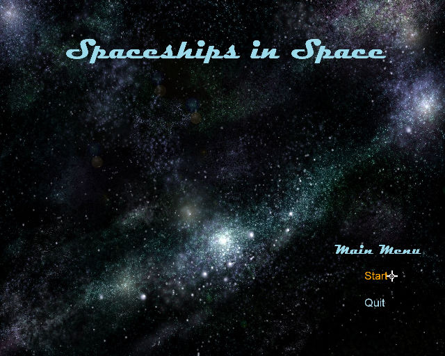
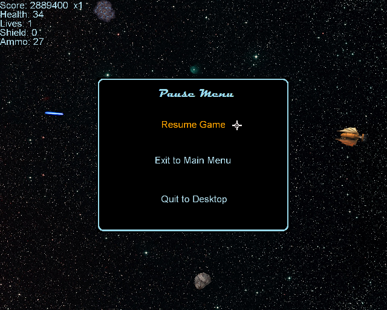
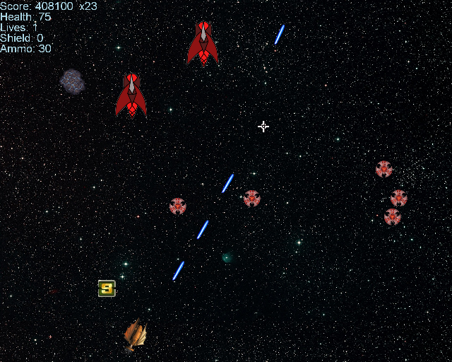
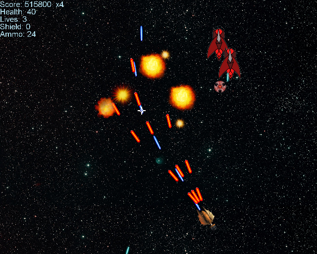
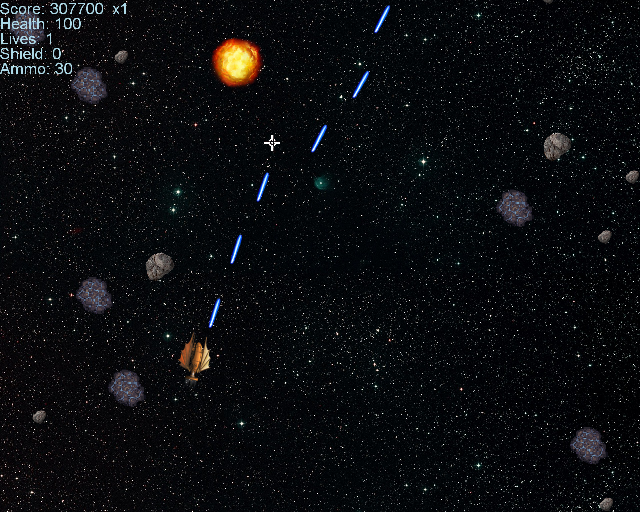
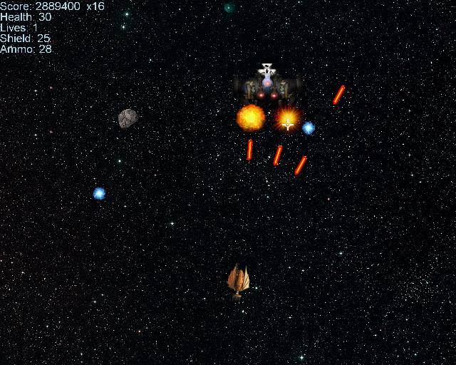

# 2D Top Down Shooter

 Spaceships in Space is a game inspired by the style and aesthetic of 
 old school arcade shooters. It was created in Visual Studio using XNA Framework
 as a group project for a software engineering class to provide experience
 with the following topics:
 - Project design and planning
 - Testing and reviews
 - Player control and movement
 - Enemy AI
 - Combat system
 - Score system
 - Game loop
 - Object creation, interaction, and cleanup
 - Menus
 
## Shooter
This folder contains the Visual Studio project with code

## Spaceships in Space
Game installation folder

## Screenshots

Main menu

Pause menu

Typical gameplay

Asteroid fields

Boss battle

Win screen

